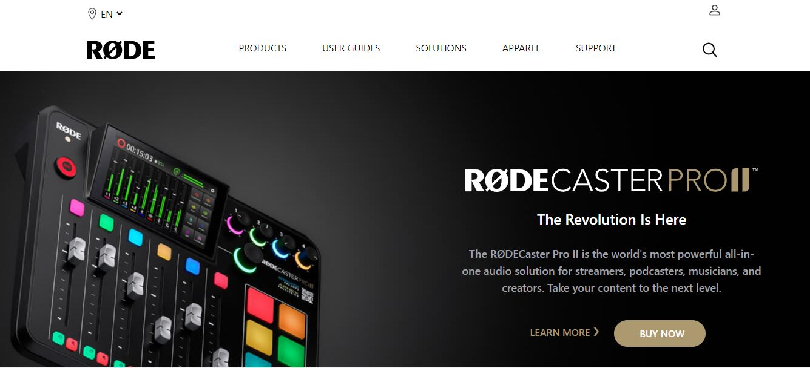
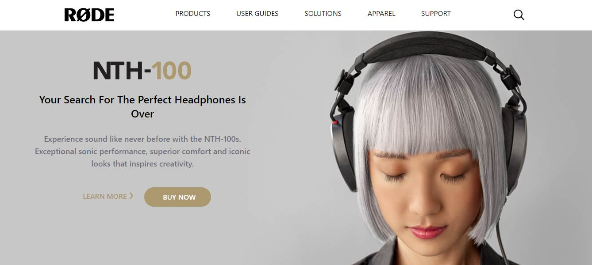
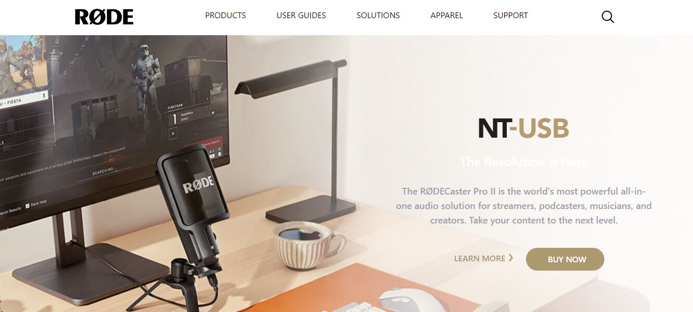
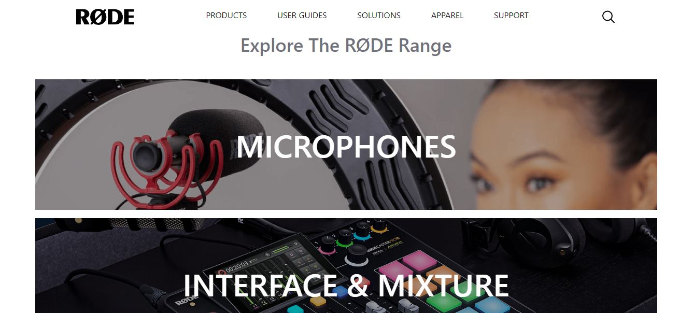
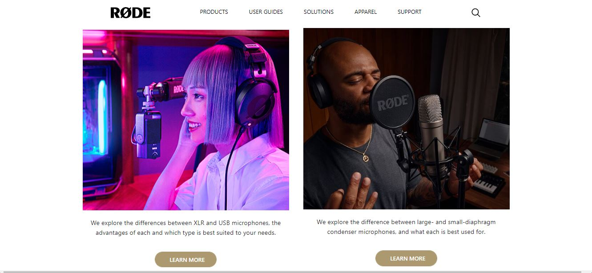
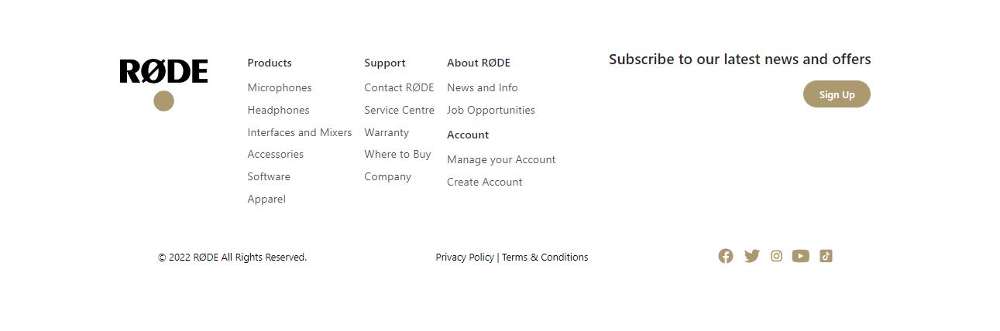

# Rode-Clone

## Project 03  [Live link]()
- Skills Gained in this project
    - Learned about Tailwind css and various properties of tailwind css.
    - Learned to make cards and mediaquery for responviveness.
    - Learned about positioning and allignment.
---

## Time taken to finish this project

- 16 hour

## Screenshots

- 1 

- 2 

- 3 

- 4 

- 5 

- 6 

